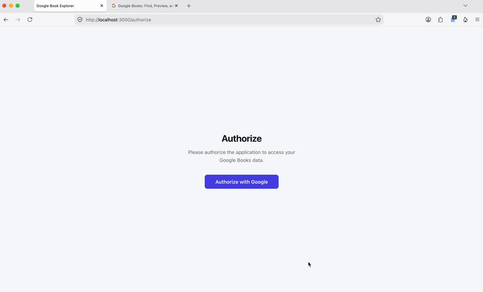

# Google Book Explorer

A full-stack book search application with Google Books integration and an LLM-powered search layer. Search by title, author, ISBN, subject, publisher, or Library of Congress number. The LLM figures out which filter to use. Add books directly to your Google library collections from the results.



## Architecture

```
Browser
  └── nginx     :3000   static files + reverse proxy
        └── api  :3001  Fastify 5 + TypeScript
                    └── redis  :6379
```

nginx is the single entry point. It serves the pre-built React frontend and proxies API, auth, and health requests to Fastify. Redis stores sessions and Google tokens.

## How it works

**Smart search.** User queries go through an LLM (OpenAI by default, Anthropic optional), which picks the right Google Books search filter — title, author, ISBN, subject, publisher, or LCCN — before hitting the API.

**Auth.** Login goes through Google OAuth with PKCE. The session and Google tokens are stored server-side in Redis.

**Collections.** Books can be added to or moved between your Google library collections (Favorites, To Read, Reading Now, Have Read). The app tracks which collection each book belongs to locally.

**Pagination.** Results are paginated; the frontend renders page controls based on the total count returned by the Google Books API.

## Quick start

**Prerequisites:** Docker, Docker Compose, API keys for [OpenAI](https://platform.openai.com/api-keys) and [Google Books](https://developers.google.com/books/docs/v1/using#APIKey), and a [Google OAuth app](https://console.cloud.google.com/apis/credentials).

```bash
git clone https://github.com/rawlinja/google-book-explorer.git
cd google-book-explorer
cp .env.example .env      # fill in your keys
./scripts/prod.sh up      # build and start everything
```

Open [http://localhost:3000](http://localhost:3000). To stop: `./scripts/prod.sh down`.

**For development** (live reload on file changes):

```bash
./scripts/install.sh   # install dependencies
./scripts/dev.sh up    # start stack + watch for frontend changes (Ctrl+C stops everything)
```

## Environment variables

| Variable | Default | Description |
|----------|---------|-------------|
| `GOOGLE_CLIENT_ID` | — | Google OAuth client ID |
| `GOOGLE_CLIENT_SECRET` | — | Google OAuth client secret |
| `GOOGLE_REDIRECT_URI` | — | OAuth callback URL — `http://localhost:3000/auth/google/callback` |
| `OPENAI_API_KEY` | — | OpenAI API key |
| `GOOGLE_BOOKS_API_KEY` | — | Google Books API key |
| `SESSION_SECRET` | — | Session encryption secret (32+ chars) |
| `REDIS_URL` | `redis://redis:6379` | Redis connection string |
| `CORS_ORIGIN` | `http://localhost:3000` | Allowed frontend origin |
| `NODE_ENV` | `development` | `development`, `production`, or `test` |
| `PORT` | `3001` | API server port |
| `LLM_PROVIDER` | `openai` | LLM provider for query routing — `openai` or `anthropic` |
| `LLM_MODEL` | *(provider default)* | Override the model used for routing |
| `ANTHROPIC_API_KEY` | — | Required when `LLM_PROVIDER=anthropic` |

## Project structure

```
google-book-explorer/
├── frontend/          # React 19 + esbuild
│   └── src/
│       ├── components/
│       ├── pages/
│       ├── store/
│       └── lib/
├── api/               # Fastify 5 + TypeScript
│   └── src/
│       ├── plugins/
│       ├── hooks/
│       ├── routes/
│       ├── services/
│       └── lib/
├── nginx/             # nginx configs + Dockerfile
├── docker-compose.yml
├── docker-compose.dev.yml
├── .env.example
└── scripts/
    ├── install.sh
    ├── dev.sh
    ├── prod.sh
    ├── eval.sh
    └── logs.sh
```

## License

MIT
