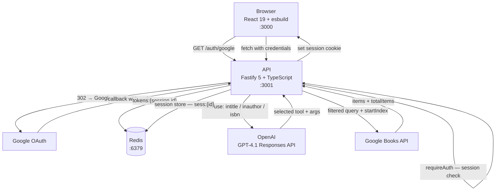

# Architecture

## Overview

Google Book Explorer is a full-stack book search application with an AI-powered query layer. Users authenticate via Google OAuth, then search for books by title, author, or ISBN — GPT-4.1 picks the right Google Books filter via tool use.

## Services

### Frontend (`frontend/`)

- React 19, esbuild, pnpm
- Dev server on `:3000` with SPA fallback
- `process.env.API_URL` injected at build time via esbuild `define`
- State: Zustand (`isLoggedIn`, `expiresAt`, `checking`) + TanStack Query for book fetches
- Session-expiry timer reads `expiresAt` from `/api/me` and auto-logs out when it fires
- Last search results and query persisted in `sessionStorage` via Zustand `persist`

Routes:
| Path | Component | Notes |
|------|-----------|-------|
| `/` | — | Redirects to `/books` or `/authorize` based on auth state |
| `/books` | `Books` | Protected — book search UI with pagination |
| `/authorize` | `Authorize` | Google OAuth login page |
| `/auth-signed-in` | `AuthSignedIn` | OAuth landing; calls `/api/me`, redirects to `/books` |

### API (`api/`)

- Fastify 5 + TypeScript, pnpm
- Config validated with Zod at startup — process exits immediately on missing vars
- Auth: `openid-client` PKCE flow, Redis-backed Fastify session (no JWT)

**Why session-only, no JWT:** Every request already hits Redis to load the session. A JWT would buy stateless verification but we'd still need Redis to store and revoke Google tokens — so the stateless benefit doesn't apply. One mechanism is simpler than two.

Routes:
| Method | Path | Auth | Description |
|--------|------|------|-------------|
| GET | `/health` | — | Health check |
| GET | `/auth/google` | — | Start OAuth PKCE flow |
| GET | `/auth/google/callback` | — | Exchange code, set session |
| POST | `/auth/logout` | — | Delete Redis tokens, destroy session, clear cookie |
| GET | `/api/me` | session | Returns `{ isLoggedIn, expiresAt }` |
| GET | `/api/books/search?q=&page=` | session | LLM tool use → Google Books |

## Auth Flow

1. Frontend redirects to `GET /auth/google`.
2. API generates PKCE `codeVerifier` + `state`, stores both in the Redis-backed session, redirects to Google.
3. Google redirects to `GET /auth/google/callback`; API exchanges the code, stores Google tokens in Redis under `tokens:{session.id}`, sets `session.authenticated = true` and `session.expiresAt = Date.now() + 3600000`.
4. `requireAuth` hook checks `req.session.authenticated` on every protected route.
5. `POST /auth/logout` deletes the Redis token entry, destroys the session, and explicitly clears the `sessionId` cookie so the browser discards it immediately.

## Book Search Flow

1. Frontend sends `GET /api/books/search?q=<query>&page=<n>`.
2. `requireAuth` checks session.
3. `startIndex = (page - 1) * 10` is computed and passed to `searchBooks`.
4. GPT-4.1 via the Responses API selects one of three tools: `get_books_by_title`, `get_books_by_author`, `get_books_by_isbn`.
5. The selected tool calls the Google Books API with the appropriate qualifier (`intitle:`, `inauthor:`, `isbn:`) and `startIndex`.
6. Response includes `{ totalItems, items }` — `totalItems` comes from the Google Books API, enabling frontend pagination.

## Source References

| File | Purpose |
|------|---------|
| `api/src/config/index.ts` | Zod env schema |
| `api/src/app.ts` | Fastify instance, plugin + route registration |
| `api/src/plugins/redis.ts` | ioredis client as Fastify decorator |
| `api/src/hooks/requireAuth.ts` | Session auth guard |
| `api/src/routes/auth.ts` | Google OAuth PKCE routes |
| `api/src/routes/me.ts` | `/api/me` |
| `api/src/routes/books.ts` | `/api/books/search` |
| `api/src/services/bookSearch.ts` | OpenAI tool-use orchestration |
| `api/src/services/googleBooks.ts` | Google Books API client |
| `frontend/src/store/index.ts` | Zustand session state |
| `frontend/src/store/books.ts` | Zustand book search cache |
| `frontend/src/lib/api.ts` | `getMe`, `login`, `logout` helpers |
