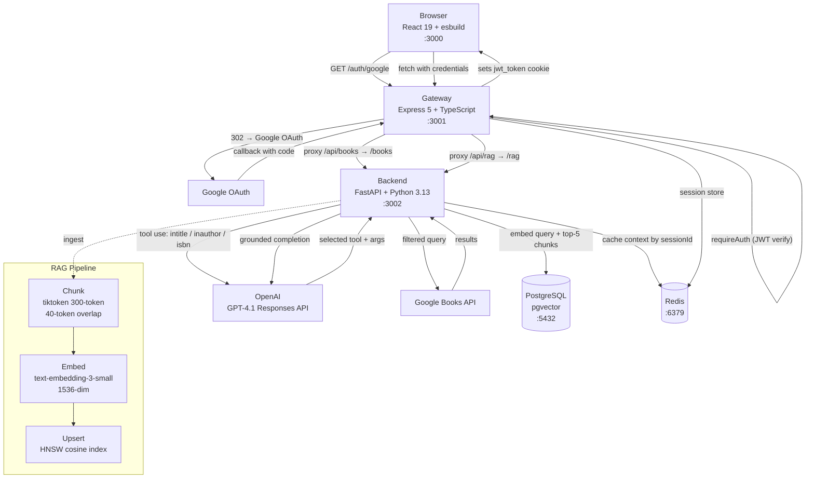

# Architecture

## Overview

Google Book Explorer is a full-stack book search application with an AI-powered query layer and a RAG pipeline for semantic search and grounded question-answering.

Primary flow:
1. Browser authenticates via Google OAuth through the gateway (PKCE flow).
2. Gateway issues a signed JWT cookie and stores session state in Redis.
3. All API requests carry the cookie; gateway verifies the JWT and proxies authenticated requests to the backend.
4. Book search queries are routed to the Python backend where GPT-4.1 picks the right Google Books filter via tool use.
5. The RAG pipeline ingests book descriptions, chunks and embeds them into pgvector, and generates grounded answers on demand.

## Services

### Frontend

- React 19, esbuild, pnpm
- Dev server: `esbuild` with `ctx.watch()` + `ctx.serve()` (SPA fallback on `:3000`)
- `process.env.API_URL` injected at build time via esbuild `define`
- State: Zustand (`isLoggedIn`, `expiresAt`, `checking`) + TanStack Query for book search fetches
- Session-expiry timer auto-calls logout when the Google token expires
- Persists last search results and query in `sessionStorage` via Zustand `persist`

Routes:
- `/` — redirects based on auth state
- `/books` — protected book search UI
- `/authorize` — Google OAuth login page
- `/auth-signed-in` — OAuth landing; sets session state and redirects to `/books`

### Gateway

- Express 5 + TypeScript, pnpm
- Config parsed and validated with Zod at startup (process exits on missing vars)
- Auth: `openid-client` PKCE flow, JWT (`jsonwebtoken`) in `httpOnly` cookie
- Session: `express-session` backed by Redis (`connect-redis`)
- Proxy: `http-proxy-middleware` v3 strips `/api` prefix before forwarding to backend

Key routes:
- `GET /auth/google` — builds PKCE authorization URL, stores verifier in session
- `GET /auth/google/callback` — exchanges code, signs JWT, sets cookie
- `POST /auth/logout` — clears cookie, destroys session
- `GET /api/me` — returns session user info
- `GET /api/books/*` — `requireAuth` + proxy → backend `/books/*`
- `POST /api/rag/*` — `requireAuth` + proxy → backend `/rag/*`
- `GET /health`

### Backend

- FastAPI + Python 3.13, managed with `uv`
- DB: asyncpg connection pool to PostgreSQL (pgvector extension)
- Cache: Redis async client for session-scoped RAG context caching

Key routes:
- `GET /books/search?q=` — LLM tool use → Google Books API
- `POST /rag/ingest` — chunk, embed, upsert into pgvector
- `POST /rag/search` — nearest-neighbor vector search
- `POST /rag/generate` — Redis cache check → embed → pgvector → GPT-4.1 completion
- `GET /health`

## Data Flow Details

### Auth flow

1. Frontend redirects to `GET /auth/google`.
2. Gateway builds a PKCE authorization URL via `openid-client` and stores `codeVerifier` + `state` in the Redis-backed Express session.
3. Google redirects to `GET /auth/google/callback`; gateway exchanges the code, signs a JWT containing the Google access/id/refresh tokens, and sets it as an `httpOnly` cookie (`jwt_token`).
4. `requireAuth` middleware verifies the JWT on every proxied request. Unauthenticated requests are rejected before reaching the backend.
5. `POST /auth/logout` clears the cookie and destroys the session.

### Book search (LLM tool routing)

1. Frontend sends `GET /api/books/search?q=<query>` with credentials.
2. Gateway verifies JWT and proxies to `GET /books/search?q=<query>` on the backend.
3. Backend sends the query to GPT-4.1 via the OpenAI Responses API with three tools: `get_books_by_title`, `get_books_by_author`, `get_books_by_isbn`.
4. The model picks the right filter; backend appends `intitle:`, `inauthor:`, or `isbn:` and calls the Google Books API.
5. Results flow back through the proxy to the browser.

### RAG ingest

1. `POST /rag/ingest` accepts `volumeId`, `title`, `description`, `authors`, and `categories` in the request body.
2. Backend upserts the book into the `books` table (`ON CONFLICT (volume_id)`), then chunks the title + description.
3. tiktoken chunks the text (300-token windows, 40-token overlap).
4. Each chunk is embedded with `text-embedding-3-small` (1536 dimensions).
5. Vectors are upserted into the `book_chunks` table (pgvector `VECTOR(1536)`, HNSW cosine index).

### RAG generate

1. `POST /rag/generate` receives `{ query, sessionId }`.
2. Backend checks Redis for a cached context keyed by `sessionId`.
3. On miss: embeds the query, fetches the top-5 nearest chunks via `<=>` (cosine), caches them.
4. GPT-4.1 chat completion is called with the chunks as grounded context.
5. Generated answer is returned to the frontend.

## Database Schema

Defined by `backend/migrations/001_schema.sql`, auto-applied by Postgres on first container start.

Tables:
- `books` — `id`, `volume_id`, `title`, `authors TEXT[]`, `categories TEXT[]`, `description`, `metadata JSONB`, `created_at`, `updated_at`
- `book_chunks` — `id`, `book_id`, `chunk_index`, `content`, `embedding VECTOR(1536)`, `created_at`

Index: `HNSW` on `book_chunks.embedding` with cosine distance operator class.

## Source References

- Frontend entry: `frontend/src/main.tsx`
- Frontend session store: `frontend/src/store/index.ts`
- Frontend books store: `frontend/src/store/books.ts`
- Gateway config: `gateway/src/config/index.ts`
- Gateway auth routes: `gateway/src/routes/auth.ts`
- Gateway proxy: `gateway/src/routes/proxy.ts`
- Gateway auth middleware: `gateway/src/middleware/auth.ts`
- Backend book search: `backend/app/services/book_search.py`
- Backend RAG service: `backend/app/services/rag_service.py`
- DB schema: `backend/migrations/001_schema.sql`
