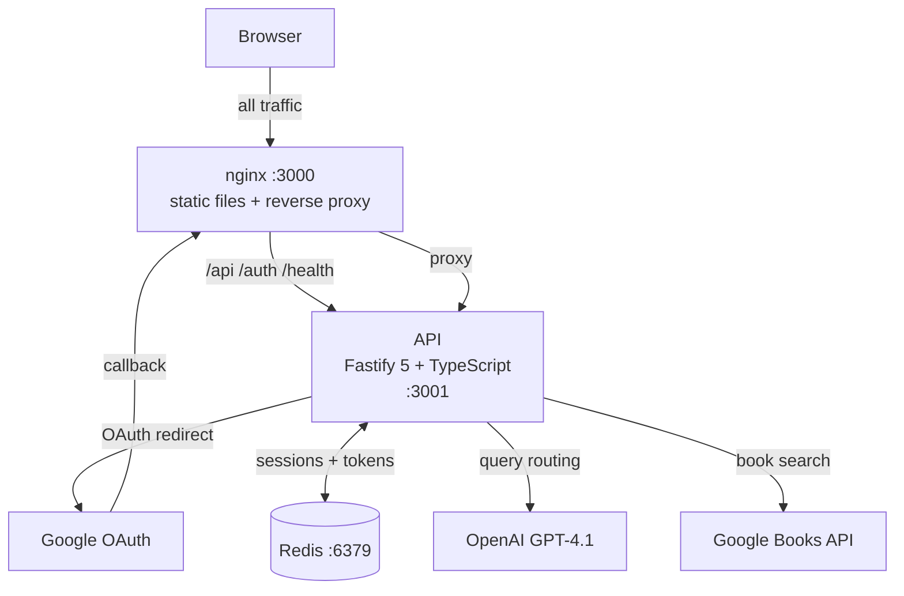

# Architecture

## Overview

Google Book Explorer is a full-stack book search application with an AI-powered query layer. Users authenticate via Google OAuth, then search for books.  GPT-4.1 decides which Google Books filter to apply based on the query.

## Services

### nginx

nginx is the single entry point on port 3000. In production it serves the pre-built React app as static files. In development it volume-mounts the build output so the frontend can update on file changes without needing to rebuild the container.

All `/api`, `/auth`, and `/health` requests are proxied through to Fastify.

### Frontend

React 19 with esbuild and pnpm. State is split between Zustand (session, collections) and TanStack Query (book search results). Collection state is tracked locally so moving a book between shelves doesn't require a round-trip to check its current location.

Routes:

| Path | Component | Notes |
|------|-----------|-------|
| `/` | — | Redirects to `/books` or `/authorize` based on auth state |
| `/books` | `Books` | Protected — book search UI with pagination |
| `/authorize` | `Authorize` | Google OAuth login page |
| `/auth-signed-in` | `AuthSignedIn` | OAuth landing; sets session state, redirects to `/books` |

### API

Fastify 5 with TypeScript and pnpm. Configuration is validated with Zod at startup — the process exits immediately if any required environment variable is missing.

Auth uses Google OAuth with PKCE via `openid-client`. Sessions are stored in Redis (no JWT).

Routes:

| Method | Path | Auth | Description |
|--------|------|------|-------------|
| GET | `/health` | — | Health check |
| GET | `/auth/google` | — | Start OAuth PKCE flow |
| GET | `/auth/google/callback` | — | Exchange code, set session |
| POST | `/auth/logout` | — | Clear tokens and destroy session |
| GET | `/api/me` | session | Current user + session expiry |
| GET | `/api/books/search?q=&page=` | session | AI-routed book search |

## Auth Flow

1. The user clicks login; the frontend redirects to `/auth/google`.
2. The API generates a PKCE challenge and redirects the browser to Google.
3. Google redirects back to `/auth/google/callback`. The API exchanges the code for Google tokens, stores them in Redis, and marks the session as authenticated.
4. Every subsequent API request is checked by the `requireAuth` hook.
5. Logout deletes the tokens from Redis, destroys the session, and clears the cookie — nothing is left server-side.

## Book Search Flow

1. The frontend sends a search query to `/api/books/search`.
2. The API passes the query to GPT-4.1, which selects the right search type: by title, author, or ISBN.
3. The API calls the Google Books API with the appropriate filter and returns paginated results.
4. The frontend uses the total count from Google to render page controls.

## Source References

| File | Purpose |
|------|---------|
| `nginx/nginx.conf` | Production nginx config |
| `nginx/nginx.dev.conf` | Dev nginx config (adds live-reload proxy) |
| `nginx/Dockerfile` | Multi-stage build: esbuild frontend → nginx:alpine |
| `api/src/config/index.ts` | Zod env schema |
| `api/src/app.ts` | Fastify instance, plugin + route registration |
| `api/src/plugins/redis.ts` | Redis client |
| `api/src/hooks/requireAuth.ts` | Session auth guard |
| `api/src/routes/auth.ts` | Google OAuth routes |
| `api/src/routes/me.ts` | `/api/me` |
| `api/src/routes/books.ts` | `/api/books/search` |
| `api/src/services/bookSearch.ts` | OpenAI tool-use orchestration |
| `api/src/services/googleBooks.ts` | Google Books API client |
| `frontend/src/store/index.ts` | Session state |
| `frontend/src/store/books.ts` | Book search cache |
| `frontend/src/store/collections.ts` | Collection state |
| `frontend/src/lib/api.ts` | API helper functions |
